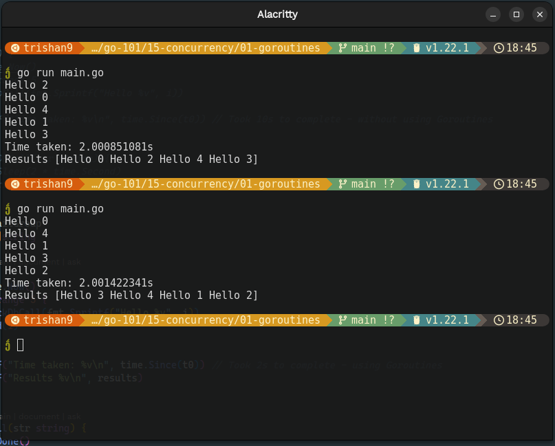
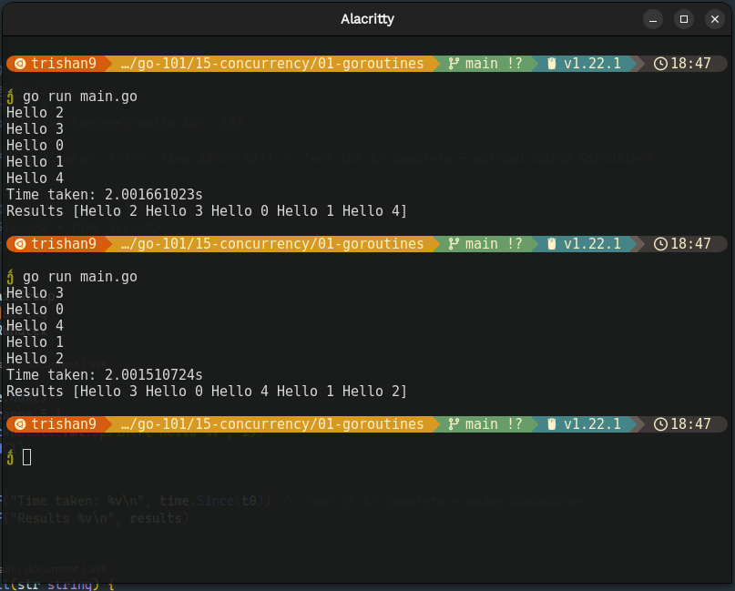

# Goroutines

- lightweight threads managed by the Go runtime.
- lighter than threads and Go runtime can manage thousands of them simultaneously.
- can be used to run background operations in a program.
- communicates through private channels so the communication between them is safer.
- With goroutines, we can split one task into different segments to perform better.

In Go, concurrency is achieved using **goroutines**. A goroutine is simply a function that is capable of running concurrently with other functions. To create a goroutine, we use the keyword `go` followed by a function invocation:

```go
func main() {
    go doSomeWork() // Spawns a new goroutine
    // Main goroutine continues execution
}

func doSomeWork() {
    // Code to be executed concurrently
}
```

_Without Goroutines_


_With Goroutines_


## Goroutines in Action

To use goroutines, we simply prefix the function or method call with the `go` keyword. This tells the Go runtime to execute the function concurrently in a new goroutine.

However, if the main goroutine doesn't wait for the goroutines to finish their execution, the program may exit before all goroutines have completed their tasks. To synchronize the execution and ensure that all goroutines have finished before exiting, we use `sync.WaitGroup` from the `sync` package.

`sync.WaitGroup` type is used to wait for a collection of goroutines to finish their execution before proceeding. It provides a simple way to synchronize goroutines and ensure that all of them have completed their tasks. It ensures that the main goroutine waits for all the other goroutines to finish before proceeding, allowing for proper synchronization.

```go
func sayHello() {
    defer wg.Done() // Decrement the WaitGroup counter when the goroutine finishes
    fmt.Println("Hello from goroutine")
}

func main() {
    var wg sync.WaitGroup

    // Increment the WaitGroup counter
    wg.Add(1)

    go sayHello()

    // Wait for all goroutines to finish
    wg.Wait()

    // Main goroutine resumes after all goroutines have finished
    fmt.Println("Main goroutine exiting")
}
```

However, when working with shared data accessed by multiple goroutines concurrently, we need to ensure proper synchronization to prevent race conditions. For this purpose, we use synchronization primitives like mutexes `sync.Mutex` and read-write mutexes `sync.RWMutex`.

Race Conditions - let's say one goroutine is trying to write in the memory, and another goroutine at the same time is trying to write in the same memory. Then, this condition is called the race condition, and the data in the memory will not be consistent, we might lost some data while trying to write in the memory. For this, we need to make proper use of Mutex or RWMutex locks.
To check whether our program can have race conditions: `go run --race main.go`

In Go, a mutex (short for mutual exclusion) is a synchronization primitive used to protect shared resources from simultaneous access by multiple goroutines. It ensures that only one goroutine can access a critical section of code at a time, preventing race conditions and maintaining data integrity.

```go
var (
	counter = 0
	mux   sync.Mutex
	wg      sync.WaitGroup
)

func increment() {
	defer wg.Done()

	mux.Lock()
	counter++
	mux.Unlock()
}

func main() {
    for i := 0; i < 100; i++ {
        wg.Add(1)
		go increment()
	}

	wg.Wait()
	fmt.Println("Counter:", counter)
}
```

Mutex provides exclusive access, allowing only one goroutine to access a critical section of code at a time. This prevents race conditions and ensures data integrity by blocking other goroutines from acquiring the lock until it is released.

RWMutex allows multiple goroutines to have concurrent read access to a shared resource, while still providing exclusive write access. Multiple goroutines can acquire the read lock simultaneously, but when a goroutine acquires the write lock, it blocks other goroutines from acquiring either the read or write lock until it is released. This allows for efficient read access when there are a limited number of writers.

_Without Mutex - All the results are not appended to slice_


_With Mutex - All the results are appended to slice_

