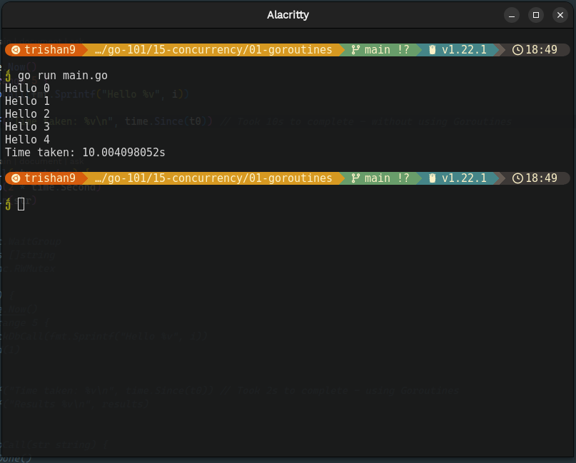
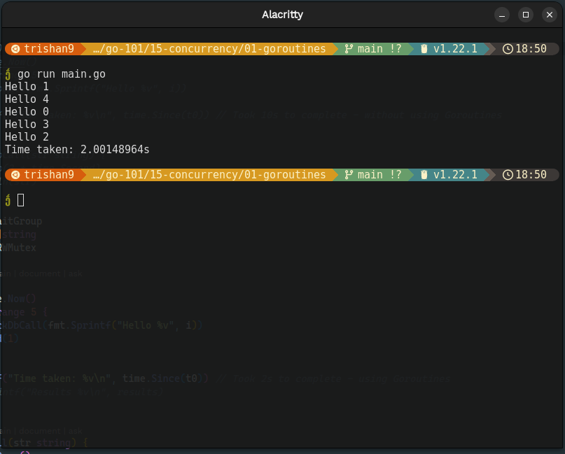

# Concurrency

- means able to execute multiple processes at same time.
- is a feature that allows to write programs that can execute multiple tasks concurrently.
- allows multiple tasks to run independently of each other in same program structure.

## Concurrency v/s Parallelism

Concurrency in Go refers to the ability to execute multiple tasks independently, but not necessarily at the same time. It allows for the efficient utilization of resources by switching between tasks when one is waiting for I/O or blocked.

On the other hand, parallelism in Go involves executing multiple tasks simultaneously, in a truly parallel manner. It means performing the same task at the exact same time without switching between tasks. An example of parallelism would be me myself eating rice, watching TMKOC on PC, and simultaneously browsing social media in Mobile.

**Concurrency**

- Dealing with multiple tasks/computations simultaneously
- Achieved using goroutines and channels
- About structuring the program and managing control flow

**Parallelism**

- Utilizing multiple CPUs/cores to run computations simultaneously
- Enabled by Go's runtime scheduler spreading goroutines across CPUs
- About improving performance by doing more work concurrently

In Go:

- Concurrency is a language feature (goroutines, channels)
- Parallelism is a runtime feature (scheduler, multiple CPUs)
- Concurrency enables parallelism when there's enough parallel work

So concurrency is about structure, parallelism is about actual simultaneous execution to improve performance.

_Without Concurrency - takes 10+ seconds_

_With Concurrency - takes 2 seconds_

